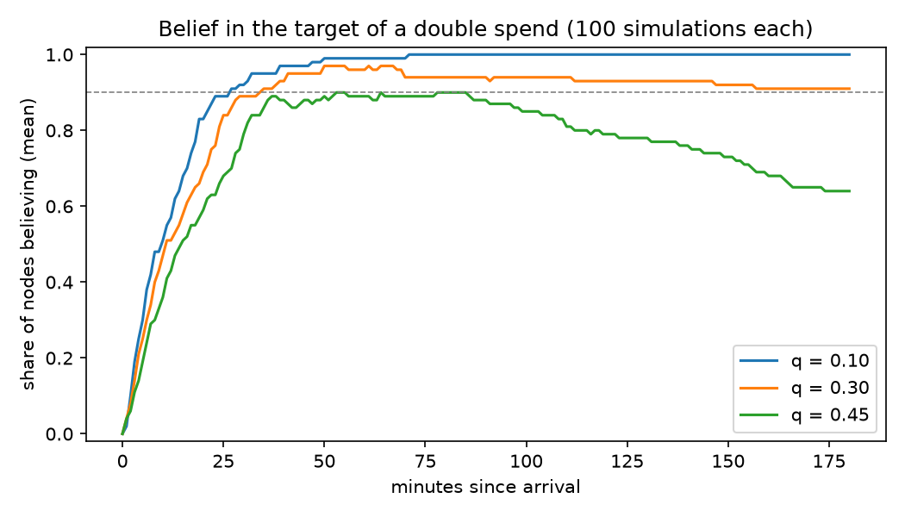

# CNSim: Consensus Network Simulator

CNSim is a discrete-event simulator of blockchain consensus networks, built to measure **transaction finality**: the probability that, within a given time after it arrives, a transaction is believed by the network (a threshold share of nodes has it in their main chain) and keeps being believed. Nodes mine or win slots, relay transactions and blocks over a network with realistic delays, fork and reorganize. Every node reports what it believes over time, and many independent simulations turn those reports into finality estimates with confidence intervals.

This repository is the MSc-thesis fork (York University, 2025) of the Conceptual Modeling Group's simulator. It adds attacker models, more networks and chains, validation against closed-form results, a much faster engine, and an analysis tool.



*Belief in the target of a double-spend attack over 100 simulations per attacker share (`tools/demo.sh`, about 15 s). Estimated finality at threshold 0.9 within 3 hours: 1.00 against a 10% attacker, 0.91 [0.84, 0.95] against 30%, 0.64 [0.54, 0.73] against 45%.*

## Quick start

Requirements: JDK 21 or newer and Maven; [uv](https://docs.astral.sh/uv/) for the analysis tool.

```bash
mvn -q package -DskipTests                       # target/cnsim-0.0.1-SNAPSHOT.jar
java -jar target/cnsim-0.0.1-SNAPSHOT.jar -c examples/networks/litecoin.properties --sims 10
cd tools/finality && uv run cnsim-finality finality ../../out/litecoin --horizon 3600
tools/demo.sh                                    # the figure above
```

Or without a local JDK:

```bash
docker build -t cnsim .
docker run --rm --user "$(id -u):$(id -g)" -v "$PWD/out:/cnsim/out" cnsim -c examples/networks/litecoin.properties --sims 10
```

Any configuration key can be overridden on the command line, which makes parameter sweeps one-liners:

```bash
java -jar target/cnsim-0.0.1-SNAPSHOT.jar -c examples/networks/bitcoin.properties \
    --set net.topology=small-world --set net.latencyMean=150 --set pow.targetBlockInterval=60000
```

## What it simulates

| | |
|---|---|
| **Block production** | Proof of work with exponential mining times (difficulty given, or derived from a target block interval); proof of stake as an Ouroboros-Praos-style slot lottery. |
| **Chains** | Presets for Bitcoin, Bitcoin Cash, Litecoin, Dogecoin, Zcash, Ethereum Classic and Cardano ([examples/networks](examples/networks/README.md)). |
| **Networks** | Every pair of nodes connected directly (the original model), or a peer-to-peer overlay: random outbound peers as in Bitcoin Core, random regular, Erdős–Rényi, small world, scale free, or your own edge list. Links have their own throughput and latency; relays add a processing delay. |
| **Consensus** | Longest chain with fee-per-byte block assembly, orphan handling, reorgs (optionally returning abandoned transactions to the pool), and a choice of tie-break (first-seen as in Bitcoin Core). |
| **Attacks** | A double-spend attacker with a hidden chain (the thesis attack), and selfish mining ([examples/attacks](examples/attacks/README.md)). |
| **Measurements** | Per-node belief in sample transactions over time; block, structure, transaction, node, network and event logs; a provenance record per run. [Estimated finality, time to finality and belief curves](tools/finality/README.md) with confidence intervals. |

All settings are listed in [docs/configuration.md](docs/configuration.md); [docs/architecture.md](docs/architecture.md) explains how a run works, with diagrams of the event flow and the two attackers.

## Validation

| Check | Result |
|---|---|
| Selfish mining vs Eyal and Sirer's revenue formula R(α, γ), with γ measured from the logs | Within ~0.01 up to α = 0.35; reproduces the ~1/3 profitability threshold |
| Double-spend success vs the exact probability of the block race (dynamic programming over the attacker's rules) | Within the 95% intervals for q = 0.1 to 0.45 (0.378 ± 0.048 vs 0.344 over 400 runs at q = 0.40) |
| Mean block interval vs target, every preset | On target (e.g. Litecoin 153 s ± 8 for 150 s; Ethereum Classic 13.3 s for 13 s) |
| Block counts over 200 simulations | Poisson-consistent (variance/mean 0.89 ± 0.10) |
| Finality estimators vs the method paper's worked example | Exact |
| Determinism | A golden run's logs are hashed in CI on JDK 21 and 25 |

Building these checks uncovered bugs that are now fixed, including a double-spend attacker that mined at twice its hash rate. See the [changelog](CHANGELOG.md).

## Performance

One simulation of the thesis base configuration (11 nodes, 75,000 transactions, 4.7 simulated hours) takes **9.5 s instead of 269 s** on a laptop, with byte-identical output: the mempool keeps its fee-rate order between receipts, and chain lookups use hash sets. Logs are streamed to disk, so memory does not grow with the number of simulations.

`--parallel N` (or `-p N`) runs the simulations of a run in N processes and merges their logs. Each simulation depends only on its ID, so the merged logs are the same as a sequential run's; CI checks this on the golden run.

```bash
java -jar target/cnsim-0.0.1-SNAPSHOT.jar -c src/main/resources/new-config/thesis.bitcoin.base.properties --sims 30 --parallel 6
```

## Outputs

Each run writes a directory `<sim.output.directory>/<run id>/`:

| File | Content |
|---|---|
| `BeliefLog - <run id>.csv` | Per simulation, node, sample transaction and report time: whether the node believes it (it is on the node's main chain) |
| `BlockLog` | Every block event: validation, reception, placement, orphaning, reorg, attack actions |
| `StructureLog` | Each node's final blockchain and orphans |
| `Input`, `Nodes`, `NetLog`, `EventLog` | Transaction arrivals, node attributes, link throughputs, every event |
| `Config`, `Provenance` (.json), `ErrorLog` (.txt) | Effective configuration; commit, command line and input hashes; errors |

## Reproducing the thesis

The code that produced the thesis and CCS26 figures is at tag [`thesis-v1.0-artifact`](https://github.com/amirradjou/cnsim/tree/thesis-v1.0-artifact). [examples/thesis/README.md](examples/thesis/README.md) maps every figure to its configuration and script.

Two findings bear on those results:

- **The attacker bug above.** In the ~30% attacker scenario the attack succeeded in 20% of 30 simulations, where the block race allows 11%.
- **Replicas are not independent.** The thesis configurations switch to per-simulation seeds only at the end of the run, so the 30 simulations of a run share their mining randomness. In the base scenario this makes 30 replicas worth 8 to 15 independent ones for time to finality, and the thesis seed is a fast one ([examples/thesis/replica-independence.md](examples/thesis/replica-independence.md)). The simulator now warns about this.

## Repository layout

```
src/main/java/ca/yorku/cmg/cnsim/engine    simulation core: events, nodes, network, samplers, reporting
src/main/java/ca/yorku/cmg/cnsim/bitcoin   Nakamoto consensus: blocks, blockchain, honest / attacker / selfish nodes
examples/networks/   chain presets          examples/attacks/   attack experiments
tools/finality/      analysis (Python)      tools/attacks/      attack analysis scripts
tools/golden/        determinism check      tools/smoke.sh      runs every shipped config
tools/replicas/      replica-independence check
src/main/resources/  thesis configurations
```

## Development

```bash
mvn verify              # unit tests (JDK 21+)
tools/golden/check.sh   # the golden run must match tools/golden/expected.sha256
tools/smoke.sh          # every shipped config, shortened
cd tools/finality && uv run pytest && uv run ruff check .
```

A change that alters simulation results must update the golden hashes (`tools/golden/check.sh --update`) and say why in the commit.

## Credits and license

CNSim was created by Sotirios Liaskos and the Conceptual Modeling Group at York University ([cmg-york/cnsim](https://github.com/cmg-york/cnsim)). This fork is by Amirreza Radjou: the malicious-node strategy pattern and double-spend attack (merged upstream), the thesis experiments, and the extensions listed in the [changelog](CHANGELOG.md).

Licensed under the GNU Lesser General Public License v2.1 (see [LICENSE](LICENSE)).
