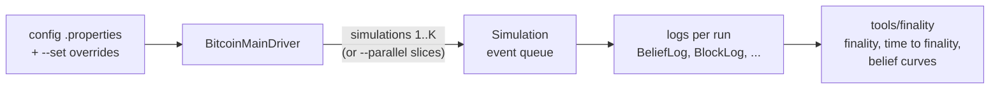
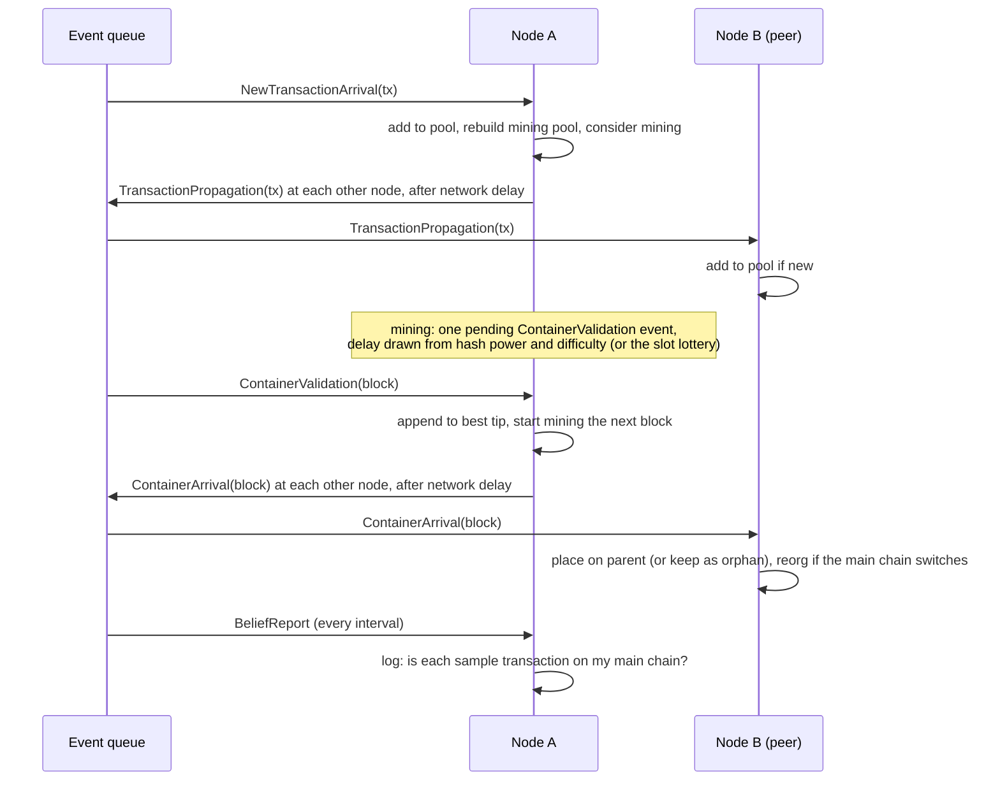
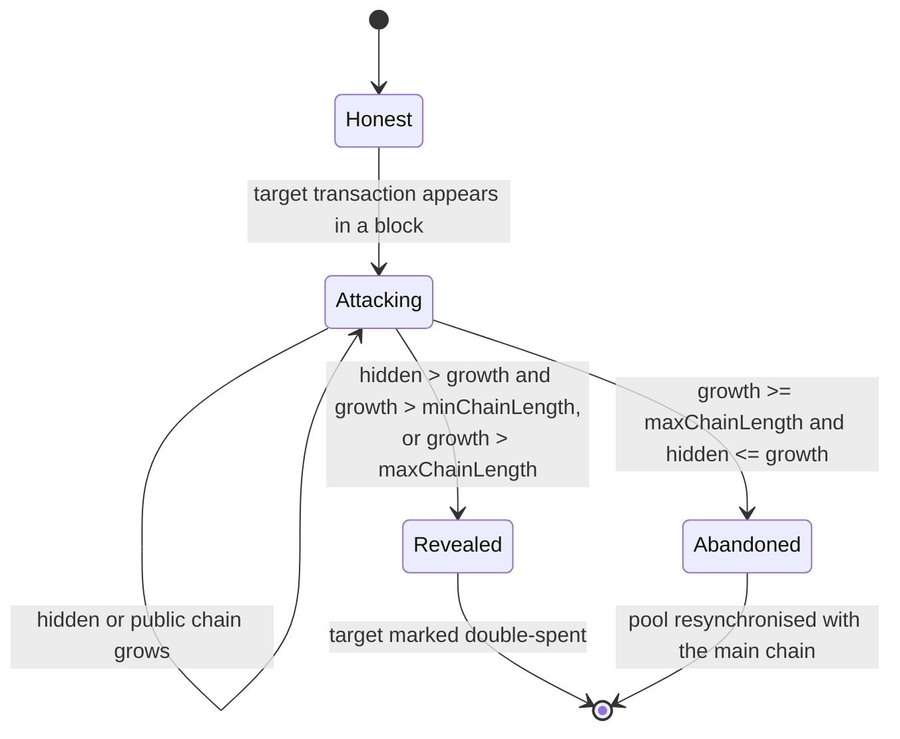
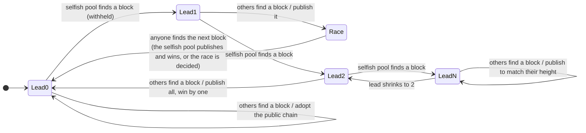

# Architecture

CNSim is a discrete-event simulator. A run executes K independent simulations of the same configuration; each simulation is a priority queue of timed events that nodes react to, and every node periodically reports what it believes. The packages split into a protocol-agnostic engine and the Nakamoto-consensus (Bitcoin) implementation.

## Packages

| Package | Contents |
|---|---|
| `engine` | `Simulation` (event loop), `Sampler` and the node / transaction / network samplers, `SeedManager`, `ParallelRunner`, `Config` |
| `engine.event` | Events: transaction arrival and propagation, container (block) validation and arrival, belief reports, seed switches |
| `engine.node` | `Node` (mining state, propagation to peers), `NodeSet` |
| `engine.network` | `RandomEndToEndNetwork` and `FileBasedEndToEndNetwork` (every pair connected), `OverlayNetwork` + `Topology` (peer-to-peer graphs), `NetworkFactory` |
| `engine.consensus` | `LeaderElection` hook, `SlotLotteryElection` (proof of stake), `ConsensusSetup` (difficulty from target interval) |
| `engine.transaction` | `Transaction`, `TransactionGroup` (pools and blocks, with an incremental fee-rate order and ID index) |
| `engine.reporter` | `Reporter` with one `LogStream` per log, `Provenance` |
| `bitcoin` | `BitcoinNode`, `Blockchain` (tips, orphans, reorgs, tie-break), `Block`, and the node behaviours: `HonestNodeBehavior`, `MaliciousNodeBehavior` (double spend), `SelfishMiningBehavior` |

## One simulation

- **Delays.** On the complete network, a message takes `size × 8000 / throughput` ms plus link latency to each node. On an overlay it takes the fastest store-and-forward path, which is when flooding first delivers it.
- **Mining.** A node keeps one pending validation event while it mines. Receiving a block does not reschedule it: block production is memoryless, and the block's parent is chosen when it completes.
- **Beliefs.** Belief is binary per node: whether the transaction is on the node's main chain. Group belief is the share of nodes believing, and finality is estimated across the K simulations (see [tools/finality](../tools/finality/README.md)).

## Randomness and replicas

All randomness comes from three seeded streams: node (attributes and mining intervals), transaction (workload), network (link properties and overlay shape). `node.sampler.seedUpdateTimes` switches the node stream to a per-simulation seed (seed + simulation ID). Simulations share their history until then and are independent afterwards, because pending mining events are redrawn at the switch. A simulation depends only on its ID, which is why `--parallel` can split a run across processes and still produce the sequential run's logs.

## Double-spend attacker

`MaliciousNodeBehavior` follows the protocol until the target transaction appears in a block. It then builds a hidden chain from that block's parent, without the target.

## Selfish miner

`SelfishMiningBehavior` implements Eyal and Sirer's Algorithm 1. The state is the private lead: the private branch's height minus the public chain's.

## Verification

- `tools/golden/check.sh` hashes the logs of a small but complete run (attacker, forks, every log). CI runs it sequentially and with `--parallel 2`, on JDK 21 and 25.
- `tools/smoke.sh` runs a shortened copy of every shipped configuration.
- The attack experiments in `examples/attacks/` compare simulated outcomes with closed-form results.
